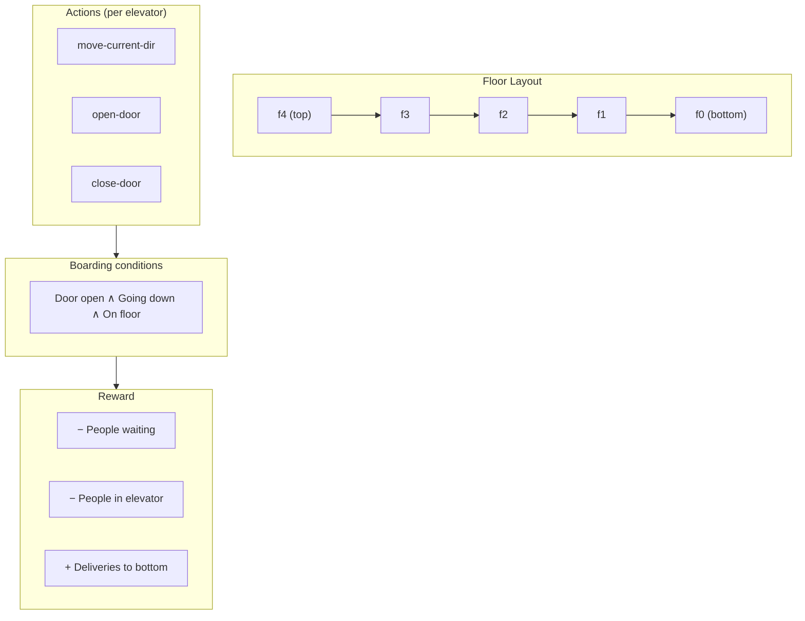
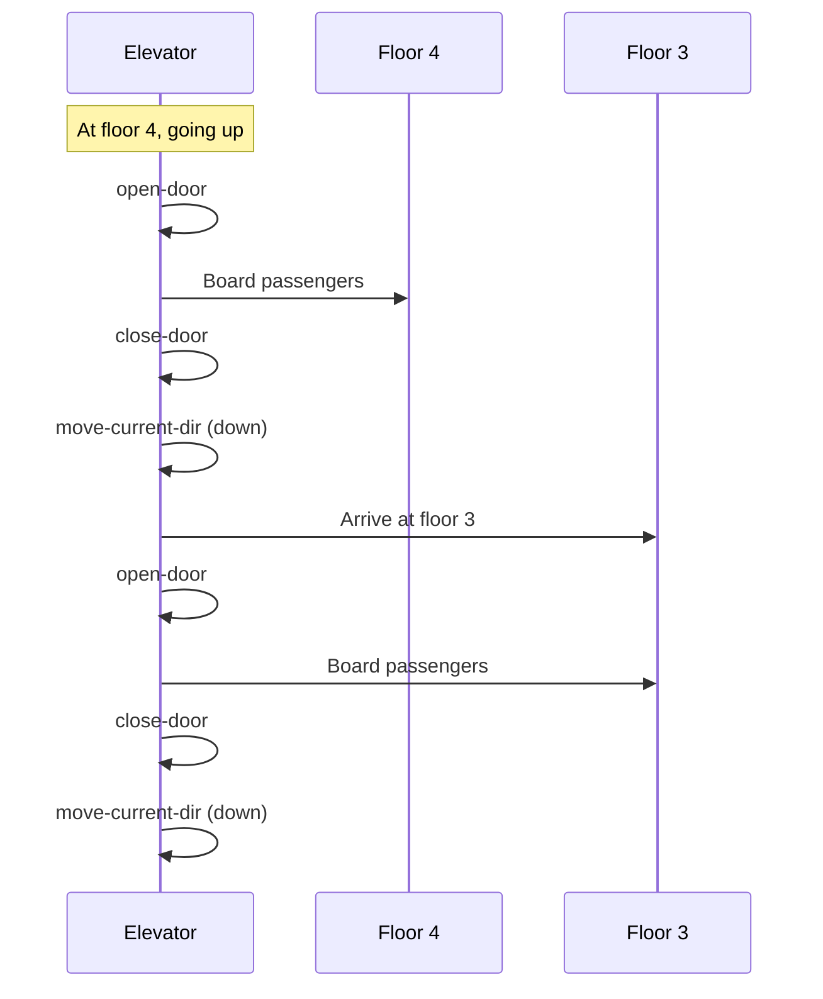

# Elevator RDDL Domain & Instance — Brief Explanation

## Overview

The elevator domain models a **stochastic MDP** where one or more elevators deliver passengers from upper floors to the bottom floor. Passengers arrive randomly (Poisson process), and the goal is to maximize reward by minimizing waiting time and maximizing deliveries.

---

## Domain (`domain.rddl`)

### What It Defines

The domain specifies the **rules** of the problem: types, state variables, actions, dynamics, and reward.

| Component | Purpose |
|-----------|---------|
| **Types** | `elevator`, `floor` — objects in the world |
| **Non-fluents** | Fixed parameters (penalties, arrival rates, capacities, floor layout) |
| **State fluents** | What changes: people waiting, people in elevator, elevator position, door state, direction |
| **Actions** | `move-current-dir`, `open-door`, `close-door` — one per elevator per step |
| **CPFs** | How state evolves: arrivals, boarding, movement, door/direction logic |
| **Reward** | Penalties for waiting + reward for deliveries |

### Key Behaviours

- **Boarding:** People board only when the elevator is on that floor, door is open, and elevator is going down.
- **Movement:** Elevator cannot move with door open; must close door before moving.
- **Direction:** Up at bottom; down at top or when door opens on an intermediate floor.
- **Pickups on the way down:** Allowed — stop at floor, open door, board, close door, continue.

---

## Instance (`instance.rddl`)

### What It Defines

The instance **instantiates** the domain with concrete objects and parameters.

| Setting | Value | Meaning |
|---------|-------|---------|
| **Objects** | 1 elevator (`e0`), 5 floors (`f0`–`f4`) | Single elevator, 5-floor building |
| **Initial state** | `elevator-at-floor(e0, f0)` | Elevator starts at bottom |
| **Floor layout** | f0 (bottom) ↔ f1 ↔ f2 ↔ f3 ↔ f4 (top) | Linear chain |
| **Arrival rates** | f1: 0.1; f2–f4: 0.15 | Poisson arrivals per floor |
| **Horizon** | 200 | 200 time steps per episode |
| **Discount** | 1.0 | No discounting |

---

## Diagram: Floor Layout & Action Flow

---

## Diagram: Pickup Sequence (Example)

---

*Last updated: March 2025*
